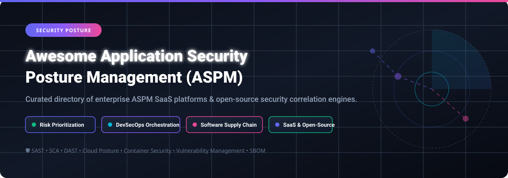

# Awesome Autonomous Vehicle Development 🚗 Simulator, ADAS & AV Software Stacks

  

---

## 📌 Top Autonomous Vehicle Development Ecosystem

**Curated List of SaaS Products & Open-Source GitHub Projects for Autonomous Driving, ADAS Simulation & Validation** 🚘⚡  

*Focused on High-Fidelity Physics Simulation, Hardware-in-the-Loop (HIL), Scenario Testing, Sensor Modeling (LiDAR, Radar, Cameras), and Production-Grade Autonomous Software Stacks.*  

📅 **Last updated: March 2026**

---

### 💡 Overview & Scope

This repository tracks top-tier **SaaS enterprise platforms** and **open-source projects** for **Autonomous Vehicle (AV) Development**. These frameworks empower automotive OEMs, Tier 1 suppliers, robotics developers, and researchers to design, simulate, test, and deploy Level 2+ to Level 4 autonomous systems safely.

- 🏢 **SaaS Leaders:** Applied Intuition, Hexagon Autonomy, dSPACE, Foretellix, Parallel Domain, IPG CarMaker, Cognata, VI-grade, BeamNG.tech.
- 🔓 **Open-Source Stacks & Simulators:** Apollo, LGSVL, CARLA, Autoware, AirSim, OpenPilot, SUMO, AWSIM.

---

## 📑 Table of Contents

- [🏢 SaaS & Enterprise Hosted Platforms](#-saas--enterprise-hosted-platforms)
- [🔓 Open-Source GitHub Projects](#-open-source-github-projects)
- [🤝 How to Contribute](#-how-to-contribute)
- [⚠️ Disclaimer](#️-disclaimer)
- [📈 Star History](#-star-history)
- [💖 Support & Sponsorship](#-support--sponsorship)

---

## 🏢 SaaS & Enterprise Hosted Platforms

The global Autonomous Vehicle (AV) & ADAS simulation software market is estimated at **$1.34 Billion in 2026** (projected to reach $5.5B+ by 2035) and is **moderately fragmented**, featuring a mix of high-growth physical-AI tech unicorns (e.g., Applied Intuition), established industrial conglomerates (Hexagon, dSPACE), and niche virtual prototyping providers.

| SaaS / Hosted Platform | Description | Company Size / Valuation | Pricing Tier (Starting) | Free Tier Limit / Trial Policy |
| :--- | :--- | :--- | :--- | :--- |
| **[Applied Intuition](https://www.appliedintuition.com/)** | End-to-end toolchain for autonomous vehicle development covering simulation, validation, and data management with high-fidelity sensor models and scenario generation. | **$15.0 Billion** valuation (2025 Series F) | Custom enterprise annual subscription starting at ~$50,000/year | No public free trial; enterprise demo / pilot access via sales request only |
| **[Hexagon Autonomy](https://hexagon.com/)** | Autonomous systems development platform combining sensor simulation, positioning, and validation tools. | **$14.2 Billion** market cap (~€5.43B annual revenue) | Enterprise custom licensing based on platform modules | 30-day evaluation trial license available upon request |
| **[dSPACE](https://www.dspace.com/)** | Simulation and validation solutions for autonomous driving with hardware-in-the-loop (HIL) testing and sensor simulation. | **~€460 Million** annual revenue (~$500M) | Enterprise custom license per seat/HIL hardware module | No free trial; test licenses provided for validated client evaluation projects |
| **[Foretellix](https://www.fortellix.com/)** | Coverage-driven verification platform for autonomous systems with formal scenario description language (M-SDL) and measurable safety metrics. | **$135 Million** total funding (~$26M annual revenue) | Enterprise subscription per project / test suite | Demo available upon request; no self-service free trial |
| **[Parallel Domain](https://paralleldomain.com/)** | Synthetic data generation and simulation platform for autonomous vehicle perception training and validation. | **$67.6 Million** total funding (Series B) | Custom usage-based tier starting at ~$25,000/project | No public free trial; sample synthetic dataset provided upon sales inquiry |
| **[IPG CarMaker](https://ipg-automotive.com/)** | Virtual vehicle development platform for testing autonomous driving functions, ADAS, and powertrain systems. | **~€36 Million** annual revenue (~$40M) | Standalone seat license starting at ~$12,000/year | 14-day evaluation license available upon request; free non-commercial university license via Formula CarMaker |
| **[Cognata](https://www.cognata.com/)** | AI-driven simulation platform for ADAS and autonomous vehicle validation with realistic 3D environments and sensor simulation. | **$27.8 Million** total funding (~$5M annual revenue) | Tiered enterprise cloud subscription | Custom demo environment available upon request; no public self-service trial |
| **[VI-grade](https://www.vi-grade.com/)** | Driving simulator and simulation software solutions for vehicle dynamics, ADAS, and autonomous driving validation. | **~$25 Million** annual revenue (Acquired by Spectris) | Professional software seat starting at ~$10,000/year | Temporary demo license granted during formal training sessions; discounted startup program available |
| **[BeamNG.tech](https://www.beamng.tech/)** | Soft-body physics-based simulation platform for autonomous vehicle development with realistic vehicle dynamics and sensor simulation. | **~$5 Million** annual revenue | Commercial license starting at ~$3,500/year | Free forever academic & research license (for eligible university students and researchers) |
| **[CARLA Cloud](https://carla.org/)** | Cloud-hosted version of the open-source CARLA simulator with managed infrastructure and scalable scenario execution. | **Open-source ecosystem** (Community maintained) | Pay-as-you-go cloud compute infrastructure cost (e.g. AWS EC2 GPU instance from ~$0.75/hr) | CARLA simulator core software is free forever (MIT License) |

---

## 🔓 Open-Source GitHub Projects

Below is a comprehensive list of top open-source autonomous driving projects, frameworks, and simulators, **sorted by GitHub star count in descending order** ⭐.

| Open-Source Project | Stars & Community | Description & Key Features | License |
| :--- | :--- | :--- | :--- |
| **[openpilot](https://github.com/commaai/openpilot)** |  | Open-source driver assistance system supporting 250+ car models. Performs Automated Lane Centering, Adaptive Cruise Control, and Driver Monitoring. | Apache-2.0 |
| **[Apollo](https://github.com/ApolloAuto/apollo)** |  | Baidu's high-performance open autonomous driving platform. Comprehensive solution covering localization, perception, planning, control, and Cyber RT runtime. | Apache-2.0 |
| **[LGSVL Simulator](https://github.com/lgsvl/simulator)** |  | Unity-based autonomous vehicle simulator from LG/Microsoft AI. Provides ROS and CyberRT integration with high-fidelity sensor simulation. | MIT / Proprietary |
| **[CARLA Simulator](https://github.com/carla-simulator/carla)** |  | Premier open-source simulator for AV research built on Unreal Engine. Offers urban environments, flexible sensor suites (LiDAR, radar, cameras), and Python APIs. | MIT |
| **[AirSim](https://github.com/microsoft/AirSim)** |  | Open-source simulator for autonomous vehicles and drones built on Unreal Engine by Microsoft AI & Research, with hardware-in-the-loop support. | MIT |
| **[Autoware](https://github.com/autowarefoundation/autoware)** |  | World's leading open-source autonomous driving software stack built on ROS2. Enables production-ready Level 4 autonomy for shuttle and passenger vehicles. | Apache-2.0 |
| **[SUMO](https://github.com/eclipse-sumo/sumo)** |  | Eclipse SUMO (Simulation of Urban MObility) is a fast, microscopic traffic simulation suite designed to handle large road networks and traffic management. | EPL-2.0 |
| **[Self-Driving Vehicle (Habrador)](https://github.com/Habrador/Self-driving-vehicle)** |  | Unity-based simulation of path planning for self-driving vehicles implementing Hybrid A* pathfinding and motion planning. | MIT |
| **[Scenic](https://github.com/berkeley-scene-language/Scenic)** |  | Domain-specific scenario description language for probabilistic scenario specification and synthetic test generation in autonomous driving. | Apache-2.0 |
| **[Pylot](https://github.com/erdos-project/pylot)** |  | Modular autonomous driving platform designed for research, running seamlessly on CARLA and real-world vehicles with low-latency dataflows. | Apache-2.0 |
| **[AWSIM](https://github.com/tier4/AWSIM)** |  | TIER IV's Unity-based autonomous driving simulator tailored as a reference environment for Autoware with ROS2 native communication. | Apache-2.0 |
| **[CARLA Scenario Runner](https://github.com/carla-simulator/scenario_runner)** |  | Traffic scenario definition engine for CARLA enabling reproducible safety verification and OpenSCENARIO standards execution. | MIT |
| **[CARLA ROS Bridge](https://github.com/carla-simulator/ros-bridge)** |  | ROS / ROS2 communication bridge for CARLA Simulator, connecting CARLA to ROS nodes and Autoware pipelines. | MIT |
| **[CARMA Platform](https://github.com/usdot-fhwa-stol/carma-platform)** |  | USDOT FHWA's Cooperative Driving Automation (CDA) platform built on ROS to enable vehicle-to-everything (V2X) cooperative maneuvers. | Apache-2.0 |
| **[carla-autoware](https://github.com/carla-simulator/carla-autoware)** |  | Integration package linking Autoware AV software stack directly into the CARLA simulation environment. | MIT |
| **[CARLA Leaderboard](https://github.com/carla-simulator/leaderboard)** |  | Official CARLA benchmarking framework evaluating autonomous driving agents across standardized urban routes and traffic scenarios. | MIT |
| **[RobotecGPULidar](https://github.com/RobotecAI/RobotecGPULidar)** |  | GPU-accelerated raycasting LiDAR simulation plugin for CARLA and custom simulation engines using OptiX / CUDA. | Apache-2.0 |

---

### 💡 Architectural Recommendation for AV Development

For building a robust end-to-end autonomous driving development pipeline:
1. **Simulation & Virtual Testing:** Combine **CARLA** or **AWSIM** for high-fidelity 3D sensor simulation with **SUMO** for macroscopic traffic flow.
2. **Autonomous Driving Stack:** Utilize **Autoware** (ROS2 native) or **Apollo** (CyberRT) for sensor fusion, localization, motion planning, and vehicle control.
3. **Scenario Verification:** Standardize test suites using **CARLA Scenario Runner** (OpenSCENARIO compliant) and **Scenic** for automated edge-case generation.
4. **V2X Cooperation:** Integrate **CARMA Platform** for testing connected and cooperative autonomous vehicle algorithms.

---

## 🤝 How to Contribute

Contributions are welcome! Please follow these simple guidelines:

1. Fork this repository 🍴
2. Create your feature branch (`git checkout -b feature/new-av-tool`)
3. Add the project to `README.md` following the table format.
4. Ensure descriptions are accurate, factual, and neutral.
5. Open a Pull Request with a clear summary 🚀

Check out our curated list hub: [Awesome-Awesome-Awesome](https://github.com/ishandutta2007/Awesome-Awesome-Awesome).

---

## ⚠️ Disclaimer

- This list is **community-curated** for educational, research, and informational purposes.
- Autonomous vehicle development tools and simulation stacks must comply with safety standards (e.g., ISO 26262, ISO 21448 / SOTIF) before real-world testing.
- Self-hosted software requires proper hardware calibration and safety drivers during physical vehicle testing.

---

## 📈 Star History

---

## 💖 Support & Sponsorship

If you found this curated list helpful in your autonomous driving research or project, please consider supporting the project:

- 🌟 **Star this repository** to help others discover it.
- 🔀 **Fork & Share** with fellow automotive engineers and researchers.
- ☕ **Buy Me a Coffee / Sponsor:** If you would like to support ongoing maintenance and new features, check out my [GitHub Sponsor Dashboard](https://github.com/sponsors/ishandutta2007).

Thank you for being part of the open-source autonomous vehicle community! 🚗✨
